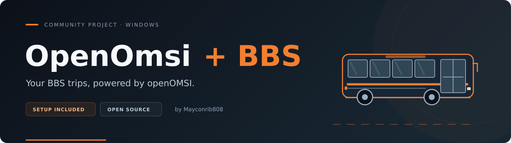

<p align="center">
  
</p>

<p align="center">
  <a href="https://github.com/Mayconrib808/OpenOmsi-BBS/releases/tag/v2.0.4"></a>
  <a href="https://github.com/Mayconrib808/OpenOmsi-BBS/actions/workflows/source-checks.yml"></a>
  <a href="https://github.com/Mayconrib808/OpenOmsi-BBS/releases"></a>
  <a href="LICENSE"></a>
</p>

<p align="center">
  <a href="https://mayconrib808.github.io/OpenOmsi-BBS/">Project website</a> ·
  <b><a href="https://github.com/Mayconrib808/OpenOmsi-BBS/releases">Releases</a></b> ·
  <a href="#installation">Quick start</a> ·
  <a href="#documentation">Documentation</a> ·
  <a href="SUPPORT.md">Support</a> ·
  <a href="README.pt-BR.md">Português do Brasil</a>
</p>

# OpenOmsi + BBS — OpenOMSI and Bus Company Simulator bridge

**OpenOmsi + BBS** connects **openOMSI** to **Bus Company Simulator / Busbetrieb-Simulator (BCS/BBS)** on Windows. Pick your trip in BBS and launch openOMSI with the bus and timetable prepared by the bridge. Company multiplayer is optional.

> [!WARNING]
> **Experimental community project.** Core trip integration and joining a hosted session have been observed in real trips. Two-player rendering and complete evaluation/payment parity still need testing. See the [validation record](docs/VALIDATION.md).

> [!IMPORTANT]
> You need your own installed **OMSI 2**, **BCS/BBS** and **openOMSI**. The games, paid addons and original BBS plugin are installed separately.

## Releases

**[Download OpenOmsi + BBS 2.0.4.zip](https://github.com/Mayconrib808/OpenOmsi-BBS/releases/download/v2.0.4/OpenOmsi.%2B.BBS.2.0.4.zip)**

| Package | Version | Download |
| --- | --- | --- |
| Complete Windows package | **2.0.4 · current release** | [OpenOmsi + BBS 2.0.4.zip](https://github.com/Mayconrib808/OpenOmsi-BBS/releases/download/v2.0.4/OpenOmsi.%2B.BBS.2.0.4.zip) |
| SHA-256 verification | 2.0.4 | [Checksum](https://github.com/Mayconrib808/OpenOmsi-BBS/releases/download/v2.0.4/OpenOmsi.%2B.BBS.2.0.4.zip.sha256) |
| Previous release | 2.0.3 | [2.0.3 release](https://github.com/Mayconrib808/OpenOmsi-BBS/releases/tag/v2.0.3) |
| Release history and notes | Published versions | [Browse Releases](https://github.com/Mayconrib808/OpenOmsi-BBS/releases) |

The complete ZIP includes **Setup.exe**, **CompanyHost.exe**, **HostAgent.exe**, the bridge launcher, compatibility facade, automatically installed 32-bit helper, the bridge's dedicated server, offline tutorial, source, credits and licenses. **No separate helper download, Go or Python installation is needed to play.**

**Latest update — 8 October 2026:** 2.0.4 fixes safe timetable selection on maps where BCS and OMSI use different route labels, including `[station_typ2]` profiles and multi-point BCS routes. It also preserves OMSI's original departure seconds when BCS only reports `HH:MM`, avoiding artificial timetable offsets. [2.0.4 release notes](https://github.com/Mayconrib808/OpenOmsi-BBS/releases/tag/v2.0.4) · [Antivirus notes](docs/ANTIVIRUS.md) · [Changelog](CHANGELOG.md).

Choose the named Windows ZIP under **Assets**. GitHub's automatic “Source code” archives contain source files and need a build first.

## What the bridge provides

| Feature | What you get |
| --- | --- |
| **Windowed Setup** | Select the games and company profile, then click **Salvar e ativar** (save and activate). |
| **Saved settings** | Game paths, player name and an imported profile copy survive package updates. |
| **Start from BBS** | Launch OpenOMSI with the bus and trip prepared by the bridge. |
| **Company multiplayer** | Find an already hosted session for the company's map and clock. Private or host-unknown player buses do not block entry. |
| **Automatic company server** | HostAgent can start the included server on demand; replacement buses are optional. |
| **Server clock** | Company sessions follow the company's configured timezone and clock shift. |
| **Player profile export** | The host can publish a player profile with the current reachable address. |
| **Local diagnostics** | **Coletar logs** creates a diagnostic ZIP for investigation. |

## Installation

1. Install **OMSI 2**, **BCS/BBS** and [**OpenOMSI**](https://github.com/openOMSI-Project/openOMSI/releases) separately, with the company map and the bus you drive.
2. Download the complete bridge ZIP and **extract everything into a permanent folder**.
3. With the games closed, open **Setup.exe** and select the original OMSI folder and `openomsi.exe`.
4. Multiplayer is optional. To play without it, leave **Ativar multiplayer da empresa** unchecked; the profile and player name can be blank. To join the company, enable it, select the profile or HTTPS link provided by the administrator, and enter your player name.
5. Click **Salvar e ativar** and accept the Windows permission request.
6. In BCS/BBS, leave **“Start OMSI faster” unchecked**. In OpenOMSI, disable synchronisation with the real-time clock.
7. Start your trip normally from BBS. If multiplayer is enabled, wait until the company server is ready.

**Players do not need to edit JSON or host a server on their own PC.** The administrator supplies the profile and hosts the session. The bridge keeps an imported profile copy for subsequent trips. Installing colleagues' buses is optional; it improves local representation when those models are available.

To disable only company multiplayer, close the games, uncheck **Ativar multiplayer da empresa** and click **Salvar e ativar** again. The bridge stays enabled. **Desativar ponte** disables the whole integration.

At the last stop: **F9 → wait at least two seconds → finish in BCS/BBS while OpenOMSI remains open**.

To return to original OMSI, close the games and click **Desativar ponte**. The bundled offline guide is **TUTORIAL.html**. [Simple player guide in Portuguese →](docs/GUIA_JOGADOR.md)

## Antivirus note

A previous 2.0.3 development package produced a reported `Trojan:Win32/Wacatac.B!ml` alert for the 32-bit helper. In 2.0.3 the helper carries explicit product/author/version/description/icon resources while keeping normal Go build identity and symbols; Setup can upgrade known older helpers with rollback on activation failure. Release CI scans the complete candidate ZIP and included executable files with Microsoft Defender. This improves transparency and reduces false-positive risk, but no project-side test can guarantee identical antivirus classification on every PC. See [ANTIVIRUS.md](docs/ANTIVIRUS.md).

## Compatibility and testing

The live-tested reference is **Windows x64 + OpenOMSI 0.2.0 + BCS/BBS 5.0.0.1**. Other versions can be selected: the bridge checks the executable's required options and helper interface, and multiplayer requires a compatible server protocol. The official **0.2.0 and 0.2.11** Windows client/server executables have passed prerequisite probes in project checks. A live trip with 0.2.11 still needs validation.

On **7 October 2026**, a **Carrão City, N407** trip using **Caio Apache VIP I OF 1721 manual** confirmed server joining, bus identity, chat, shared passengers and trip completion with a **67% BCS evaluation**. The player deliberately left through **Return to office**. One disconnect followed by reconnection occurred during the test.

**Next trip** continuity and a two-player live test still need live validation. **Red-light-specific penalties remain unavailable**: OpenOMSI does not expose the necessary telemetry through the bridge interface. Actual collision and driving counters continue to be transferred. [Traffic penalty details →](docs/TRAFFIC_PENALTIES.md) · [Validation record →](docs/VALIDATION.md)

## Documentation

| Guide | Use it for |
| --- | --- |
| [Simple player guide](docs/GUIA_JOGADOR.md) | One-time setup, playing and updating (Portuguese) |
| [Multiplayer](docs/MULTIPLAYER.md) | Profiles, sessions and administrator tasks |
| [Automatic host](docs/AUTO_HOST.md) | On-demand company server and directory setup |
| [Company clock](docs/COMPANY_CLOCK.md) | Hosting with synchronised date and time |
| [Antivirus](docs/ANTIVIRUS.md) | Defender checks and false-positive troubleshooting |
| [Traffic penalties](docs/TRAFFIC_PENALTIES.md) | Transferred data and the red-light limitation |
| [Installation](docs/INSTALL.md) | Paths, activation and restoring original OMSI |
| [Troubleshooting](docs/TROUBLESHOOTING.md) | Startup, plugin panel and timetable problems |
| [Support and diagnostics](SUPPORT.md) | Reporting a problem and reviewing diagnostic files |
| [Windows test guide](docs/TEST_ON_WINDOWS.md) | Reproducible integration checks |
| [Build from source](docs/BUILD.md) | Toolchain, package assembly and native tests |
| [Runtime effects](docs/RUNTIME_EFFECTS.md) | Files and Windows settings used by the bridge |
| [Credits and licenses](CREDITS.md) | Contributors, upstream work and notices |
| [Accessibility](ACCESSIBILITY.md) | Supported interfaces and reporting barriers |

<details>
<summary><b>How the bridge works and what it writes</b></summary>

The included `Omsi.exe` is this project's compatibility facade, not the original game executable. The helper loads only the user's locally installed original `bbs.dll`. No proprietary executables, DLLs, JARs, plugins, maps, buses, DLC assets or real account logs are distributed.

Original proprietary executables, JARs and DLLs are not patched or replaced. The bridge **does write local data**: it updates `Drivers/bbs.odr`, creates its own runtime files, deploys its helper and configures a scoped Windows Registry launch redirect. See [runtime effects](docs/RUNTIME_EFFECTS.md) and [the technical notice](NOTICE_FOR_PEDEPE.md).

For company-clock multiplayer, automatic dates follow the configured company clock. Otherwise, they use the local Windows date. Local counter translation can influence the vendor's evaluation; complete telemetry and payment parity are not promised.

</details>

## Contributing

Issues, fixes, documentation and reproducible test results are welcome. Read [CONTRIBUTING.md](CONTRIBUTING.md) and the [Code of Conduct](CODE_OF_CONDUCT.md).

For a source check, install **Go 1.23.2** and **Python 3.10+**, then run:

```sh
python3 scripts/build.py --check-only
```

The complete release build also uses the pinned native-server build described in [BUILD.md](docs/BUILD.md). Output goes to `dist/`.

## Support

[Report a bug](https://github.com/Mayconrib808/OpenOmsi-BBS/issues/new/choose) · [Suggest a feature](https://github.com/Mayconrib808/OpenOmsi-BBS/issues/new/choose) · [Security policy](SECURITY.md)

Contact **Mayconrib808** on Discord: **`.zmaycon.`** (both dots). Setup's **Coletar logs** creates local diagnostics; [review them before sharing](SUPPORT.md). Nothing is uploaded automatically.

## Credits and license

Maintained and tested by **Mayconrib808**. Implementation and review assisted by **OpenAI Codex**, credited as a development tool.

Original code, documentation and project artwork: [**MIT**](LICENSE). The helper adapts openOMSI's MIT protocol/ABI with **copyright 2026 usonskyyyy** and the [original notice](source/reference/OPENOMSI_LICENSE.txt) preserved. Go runtime notices accompany the binaries. See [all credits](CREDITS.md) and [third-party notices](THIRD_PARTY_NOTICES.md).

This is an independent project. No affiliation, endorsement, approval or official support is claimed from PeDePe GbR, openOMSI Project, MR-Software GbR, Aerosoft GmbH or Valve.
